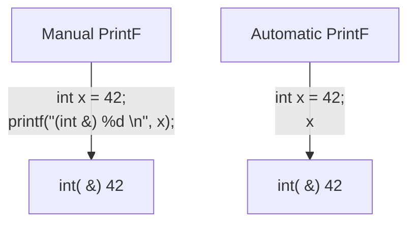

### Automatic Printf
The `Automatic Printf` feature makes it easy to display variable values during 
program execution. Using the `printf` function repeatedly is not required. 
This is achieved using an extension in the `libclangInterpreter` library.

To automatically print the value of an expression, simply write the expression 
in the global scope **without a semicolon**.



#### JPG graphic


Following are some examples:

```
clang-repl> int x = 42;
clang-repl> x       // equivalent to calling printf("(int &) %d\n", x);
(int &) 42

clang-repl> std::vector<int> v = {1,2,3};
clang-repl> v       // This syntax is fine after [D127284](https://reviews.llvm.org/D127284)
(std::vector<int> &) {1,2,3}

clang-repl> "Hello, interactive C++!"
(const char [24]) "Hello, interactive C++!"
```

### Significance of this feature
Inspired by a similar implementation in Cling, this feature added to upstream 
Clang repo has essentially extended the syntax of C++, so that it can be 
more helpful for people that are writing code for data science applications.
 
This is useful, for example, when you want to experiment with a set of values 
against a set of functions, and you'd like to know the results right-away. 
This is similar to how Python works (hence its popularity in data science 
research), but the superior performance of C++, along with this flexibility 
makes it a more attractive option.

#### Annotation Token (annot_repl_input_end)
This feature uses a new token (annot_repl_input_end) to consider printing the 
value of an expression if it doesn't end with a semicolon. When parsing an 
Expression Statement, if the last semicolon is missing, then the code will 
pretend that there one and set a marker there for later utilization, and 
continue parsing.

A semicolon is normally required in C++, but this feature expands the C++ 
syntax to handle cases where a missing semicolon is expected (i.e., when 
handling an expression statement). It also makes sure that an error is not 
generated for the missing semicolon in this specific case. 

This is accomplished by identifying the end position of the user input 
(expression statement). This helps store and return the expression statement 
effectively, so that it can be printed (displayed to the user automatically).

> Note that this logic is only available for C++ for now, since part of the 
implementation itself requires C++ features. Future versions may support more 
languages.

```
  Token *CurTok = nullptr;
  // If the semicolon is missing at the end of REPL input, consider if
  // we want to do value printing. Note this is only enabled in C++ mode
  // since part of the implementation requires C++ language features.
  // Note we shouldn't eat the token since the callback needs it.
  if (Tok.is(tok::annot_repl_input_end) && Actions.getLangOpts().CPlusPlus)
    CurTok = &Tok;
  else
    // Otherwise, eat the semicolon.
    ExpectAndConsumeSemi(diag::err_expected_semi_after_expr);

  StmtResult R = handleExprStmt(Expr, StmtCtx);
  if (CurTok && !R.isInvalid())
    CurTok->setAnnotationValue(R.get());

  return R;
}
```

##### AST Transformation

When Sema encounters the `annot_repl_input_end` token, it knows to transform 
the AST before the real CodeGen process. It will consume the token and set a 
'semi missing' bit in the respective decl.

```
  if (Tok.is(tok::annot_repl_input_end) &&
      Tok.getAnnotationValue() != nullptr) {
    ConsumeAnnotationToken();
    cast<TopLevelStmtDecl>(DeclsInGroup.back())->setSemiMissing();
  }
```

In the AST Consumer, traverse all Decls in the Decl reference, and if the 
current decl is the Top Level Decl and has a semicolon missing, then ask the 
synthesizer to synthesize another expression and replace this original 
expression.
