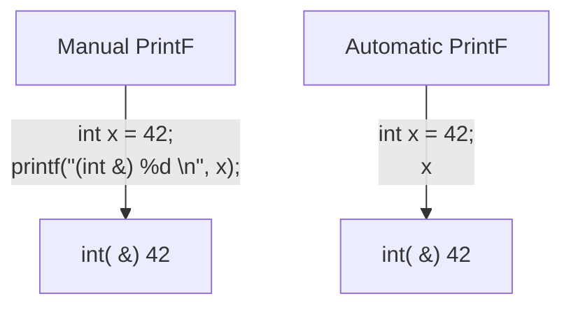
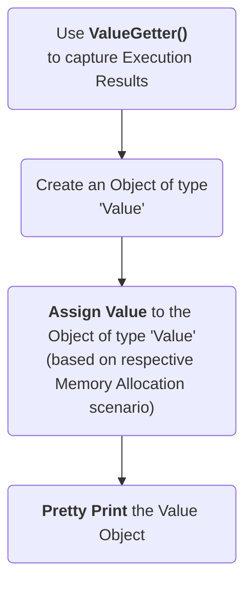
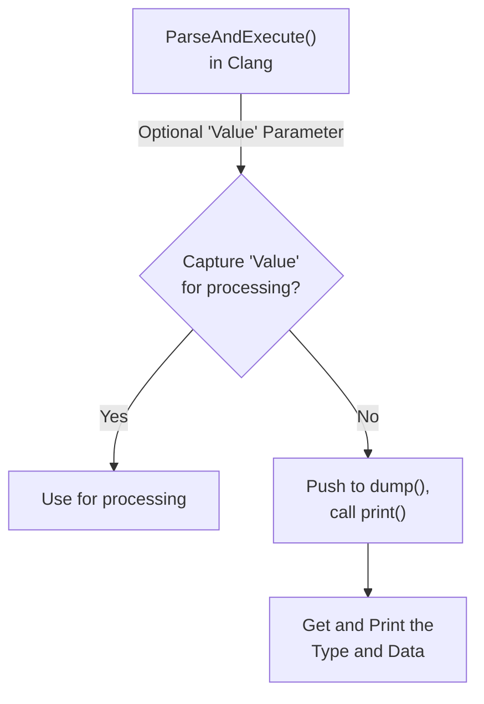

## Execution Results Handling in Clang-REPL 

Following are the major feautres contributed by Jun Zhang.

#### 1. Automatic Printf
The `Automatic Printf` feature makes it easy to display variable values during 
program execution. Using the `printf` function repeatedly is not required. 

To automatically print the value of an expression, simply write the expression 
in the global scope **without a semicolon**.

More Details: [Click here to view Automatic PrintF Feature details](Automatic_PrintF.md)

#### 2. 'Value' Interface

In many cases, it is useful to bring back the program execution result to the 
compiled program. This result can be stored in an object of type 'Value' and 
stored to be further processed or to be displayed to the user.

The `ValueGetter()` function handles different scenarios for assigning an 	
opaque (of unknown type) value to a variable. It includes different handling 
mechanisms for built-in types (like int, float, etc.), LValue Structs and 
RValue Structs.

More Details: [Click here to view Value Interface details](Value_Interface.md)

#### 3. Pretty Printing

This feature helps create a temporary dump to display the value and type 
(pretty print) of the desired data. This is a good way to interact with the 
interpreter during interactive programming. It can help organize and present 
complex information in a way that is easy to understand, especially when 
dealing with large amounts of data.

More Details: [Click here to view Pretty Printing details](Pretty_Printing.md)

### Getting to know the developer

Jun is a software engineering undergraduate student. Working on the Clang/LLVM 
infrastructure, he has contributed ~70 patches. Besides making useful 
contributions to help the High Energy Physics (HEP) field, he was also able to 
land critical patches to the upstream LLVM repositories, that will reduce the 
technical debt and help Compiler Research Organization adapt the upcoming LVVM 
versions more seamlessly. 

More Details: [Jun Zhang's Profile](JunProfile.md)

Github Profile: [junaire](https://github.com/junaire)

### Detailed RFC and Discussion

For more technical details, community discussion and links to patches related 
to these features, please visit:

[RFC on LLVM Discourse](https://discourse.llvm.org/t/rfc-handle-execution-results-in-clang-repl/68493)
