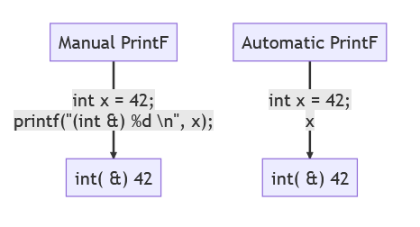
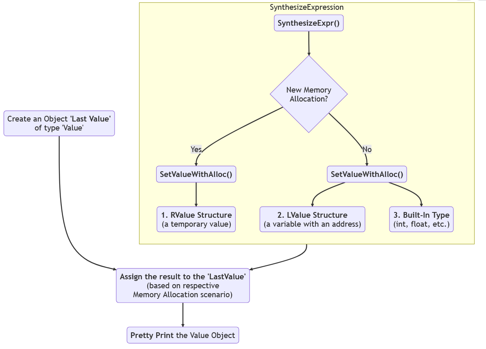
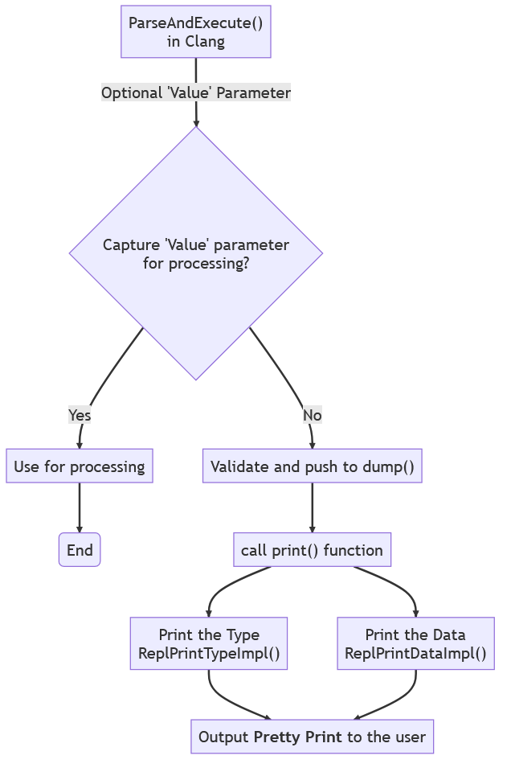

## Execution Results Handling in Clang-REPL 

Execution Results Handling features discussed below help extend the Clang-REPL 
functionality by creating an interface between the execution results of a 
program and the compiled program.

- The Automatic Printf feature makes it easy to display variable values during 
program execution. 
- The Value Synthesis feature helps store the execution results (to be able to 
bring them back to the compiled program).
- The Pretty Printing feature helps create a temporary dump to display the 
value and type (pretty print) of the desired data. 

### 1. Automatic Printf

The `Automatic Printf` feature makes it easy to display variable values during 
program execution. Using the `printf` function repeatedly is not required. 
This is achieved using an extension in the `libclangInterpreter` library.

To automatically print the value of an expression, simply write the expression 
in the global scope **without a semicolon**.



#### Examples

Following are some examples:

```
clang-repl> int x = 42;
clang-repl> x       // equivalent to calling printf("(int &) %d\n", x);
(int &) 42

clang-repl> std::vector<int> v = {1,2,3};
clang-repl> v       // This syntax is fine after [D127284](https://reviews.llvm.org/D127284)
(std::vector<int> &) {1,2,3}

clang-repl> "Hello, interactive C++!"
(const char [24]) "Hello, interactive C++!"
```

### Significance of this feature
Inspired by a similar implementation in Cling, this feature added to upstream 
Clang repo has essentially extended the syntax of C++, so that it can be 
more helpful for people that are writing code for data science applications.
 
This is useful, for example, when you want to experiment with a set of values 
against a set of functions, and you'd like to know the results right-away. 
This is similar to how Python works (hence its popularity in data science 
research), but the superior performance of C++, along with this flexibility 
makes it a more attractive option.

#### Annotation Token (annot_repl_input_end)
This feature uses a new token (annot_repl_input_end) to consider printing the 
value of an expression if it doesn't end with a semicolon. When parsing an 
Expression Statement, if the last semicolon is missing, then the code will 
pretend that there one and set a marker there for later utilization, and 
continue parsing.

A semicolon is normally required in C++, but this feature expands the C++ 
syntax to handle cases where a missing semicolon is expected (i.e., when 
handling an expression statement). It also makes sure that an error is not 
generated for the missing semicolon in this specific case. 

This is accomplished by identifying the end position of the user input 
(expression statement). This helps store and return the expression statement 
effectively, so that it can be printed (displayed to the user automatically).

> Note that this logic is only available for C++ for now, since part of the 
implementation itself requires C++ features. Future versions may support more 
languages.

```
  Token *CurTok = nullptr;
  // If the semicolon is missing at the end of REPL input, consider if
  // we want to do value printing. Note this is only enabled in C++ mode
  // since part of the implementation requires C++ language features.
  // Note we shouldn't eat the token since the callback needs it.
  if (Tok.is(tok::annot_repl_input_end) && Actions.getLangOpts().CPlusPlus)
    CurTok = &Tok;
  else
    // Otherwise, eat the semicolon.
    ExpectAndConsumeSemi(diag::err_expected_semi_after_expr);

  StmtResult R = handleExprStmt(Expr, StmtCtx);
  if (CurTok && !R.isInvalid())
    CurTok->setAnnotationValue(R.get());

  return R;
}
```

##### AST Transformation

When Sema encounters the `annot_repl_input_end` token, it knows to transform 
the AST before the real CodeGen process. It will consume the token and set a 
'semi missing' bit in the respective decl.

```
  if (Tok.is(tok::annot_repl_input_end) &&
      Tok.getAnnotationValue() != nullptr) {
    ConsumeAnnotationToken();
    cast<TopLevelStmtDecl>(DeclsInGroup.back())->setSemiMissing();
  }
```

In the AST Consumer, traverse all the Top Level Decls, to look for expressions to synthesize. If the current Decl is the Top Level Statement Decl(`TopLevelStmtDecl`) and has a semicolon missing, then ask the interpreter to synthesize another expression (an internal function call) to replace this original expression.


### 2. Value Synthesis

### Passing Execution Results to a 'Value' object

In many cases, it is useful to bring back the program execution result to the 
compiled program. This result can be stored in an object of type 'Value'. 

### Incremental AST Consumer

The `IncrementalASTConsumer` class wraps the original code generator 
`ASTConsumer` and it performs a hook, to traverse all the top-level decls, to 
look for expressions to synthesize, based on the `isSemiMissing()` condition.

If this condition is found to be true, then `Interp.SynthesizeExpr()` will be 
invoked. 

```
    for (Decl *D : DGR)
      if (auto *TSD = llvm::dyn_cast<TopLevelStmtDecl>(D);
          TSD && TSD->isSemiMissing())
        TSD->setStmt(Interp.SynthesizeExpr(cast<Expr>(TSD->getStmt())));

    return Consumer->HandleTopLevelDecl(DGR);
```

The synthesizer will then choose the relevant expression, based on its type.

#### How Execution Results are captured

The synthesizer chooses which expression to synthesize, and then it replaces 
the original expression with the synthesized expression. Depending on the 
expression type, it may choose to save an object (`LastValue`) of type 'value'
 while allocating memory to it (`SetValueWithAlloc()`), or not (
`SetValueNoAlloc()`).



### Where is the captured result stored?

`LastValue` holds the last result of the value printing. It is a class member 
because it can be accessed even after subsequent inputs. 

> If no value printing happens, then it is in an invalid state. 

### Interpreter as a REPL vs. as a Library

1 - If we're using the interpreter in interactive (REPL) mode, it will dump 
the value (i.e., value printing).

```
  if (LastValue.isValid()) {
    if (!V) {
      LastValue.dump();
      LastValue.clear();
    } else
      *V = std::move(LastValue);
  }
```

2 - If we're using the interpreter as a library, then it will pass the value 
to the user.

##### Improving Efficiency and User Experience

The Value object is essentially used to create a mapping between an expression 
'type' and the 'memory' to be allocated. Built-in types (bool, char, int, 
float, double, etc.) are simpler, since their memory allocation size is known. 
In case of objects, a pointer can be saved, since the size of the object is 
not known.

For further improvement, the underlying Clang Type is also identified. For 
example, `X(char, Char_S)`, where `Char_S` is the Clang type. Clang types are 
very efficient, which is important since these will be used in hotspots (high 
utilization areas of the program). The `Value.h` header file has a very low 
token count and was developed with strict constraints in mind, since it can 
affect the performance of the interpreter.

This also enables the user to receive the computed 'type' back in their code 
and then transform the type into something else (e.g., transform a double into 
a float). Normally, the compiler can handle these conversions transparently, 
but in interpreter mode, the compiler cannot see all the 'from' and 'to' types,
 so it cannot implicitly do the conversions. So this logic enables providing 
these conversions on request. 

On-request conversions can help improve the user experience, by allowing 
conversion to a desired 'to' type, when the 'from' type is unknown or unclear

#### Significance of this Feature

The 'Value' object enables wrapping a memory region that comes from the 
JIT, and bringing it back to the compiled code (and vice versa). 
This is a very useful functionality when:

- connecting an interpreter to the compiled code, or
- connecting an interpreter in another language.

For example, the `CPPYY` code makes use of this feature to enable running 
C++ within Python. It enables transporting values/information between C++ 
and Python.

In a nutshell, this feature enables a new way of developing code, paving the 
way for language interoperability and easier interactive programming.

#### Communication between Compiled Code and Interpreted Code

In Clang-REPL there is **interpreted code**, and this feature adds a 'value' 
runtime that can talk to the **compiled code**.

Following is an example where the compiled code interacts with the interpreter 
code. The execution results of an expression are stored in the object 'V' of 
type Value. This value is then printed, effectively helping the interpreter 
use a value from the compiled code.

```
int Global = 42;
void setGlobal(int val) { Global = val; }
int getGlobal() { return Global; }
Interp.ParseAndExecute(“void setGlobal(int val);”);
Interp.ParseAndExecute(“int getGlobal();”);
Value V;
Interp.ParseAndExecute(“getGlobal()”, &V);
std::cout << V.getAs<int>() << “\n”; // Prints 42
```

> Above is an example of interoperability between the compiled code and the 
interpreted code. Interoperability between languages (e.g., C++ and Python) 
works similarly.


### 3. Pretty Printing

This feature helps create a temporary dump to display the value and type 
(pretty print) of the desired data. This is a good way to interact with the 
interpreter during interactive programming.

#### How it works



#### Parsing mechanism

The Interpreter in Clang-REPL (`interpreter.cpp`) includes the function 
`ParseAndExecute()` that can accept a 'Value' parameter to capture the result. 
But if the value parameter is made optional and it is omitted (i.e., that the 
user does not want to utilize it elsewhere), then the last value can be 
validated and pushed into the `dump()` function. 

```
llvm::Error Interpreter::ParseAndExecute(llvm::StringRef Code, Value *V) {

  auto PTU = Parse(Code);
  if (!PTU)
    return PTU.takeError();
  if (PTU->TheModule)
    if (llvm::Error Err = Execute(*PTU))
      return Err;

  if (LastValue.isValid()) {
    if (!V) {
      LastValue.dump();
      LastValue.clear();
    } else
      *V = std::move(LastValue);
  }
  return llvm::Error::success();
}
```


The `dump()` function (in `value.cpp`) calls the `print()` function.

```
void Value::print(llvm::raw_ostream &Out) const {
  assert(OpaqueType != nullptr && "Can't print default Value");

  if (getType()->isVoidType() || !isValid())
    return;

  std::string Str;
  llvm::raw_string_ostream SS(Str);

  //Print the Type and Data
  
  SS << "(";
  printType(SS);
  SS << ") ";
  printData(SS);
  SS << "\n";
  Out << Str;
}
```

Printing the Data and Type are handled in their respective functions: 
`ReplPrintDataImpl()` and `ReplPrintTypeImpl()`

#### Complex Data Types

This feature can print out primitive types (int, char, bool, etc.) easily. 
For more complex types (e.g., `std::vector`), it falls back to a runtime 
function call using the following helper function.

```
static std::string SynthesizeRuntimePrint(const Value &V) {
  Interpreter &Interp = const_cast<Interpreter &>(V.getInterpreter());
  Sema &S = Interp.getCompilerInstance()->getSema();
  ASTContext &Ctx = S.getASTContext();

  static bool Included = false;
  if (!Included) {
    Included = true;
    llvm::cantFail(
        Interp.Parse("#include <__clang_interpreter_runtime_printvalue.h>"));
  }
```

The included header file `__clang_interpreter_runtime_printvalue.h` includes 
functions that can be called to handle complex types (e.g., STL components).

> This header is only included on-demand, where needed, since it is an 
expensive runtime operation.

##### Users can create their own types

All overloads live in a header, which are included at runtime. So "print a 
std::vector" is equivalent to `PrintValueRuntime(&v);`.

This means users can write their own overload for their types:

```
clang-repl> struct S{};
clang-repl> std::string PrintValueRuntime(const S* s) { return “My printer!”; }
clang-repl> S{}
(S) “My Printer!” 
```


### Detailed RFC and Discussion

> Developer: [junaire](https://github.com/junaire)

For more technical details, community discussion and links to patches related 
to these features, please visit:

[RFC on LLVM Discourse](https://discourse.llvm.org/t/rfc-handle-execution-results-in-clang-repl/68493)

> Some logic presented in the RFC (e.g. ValueGetter()) may be outdated, 
compared to the final developed solution.