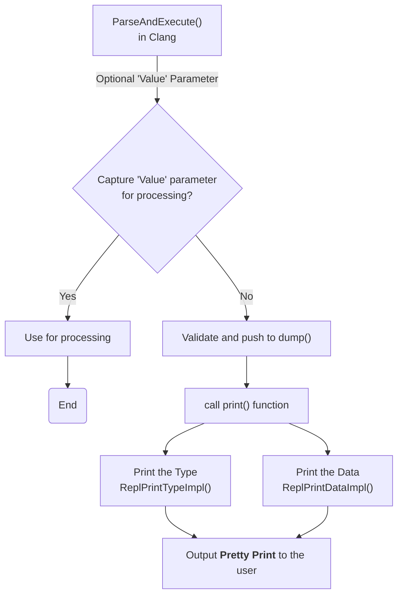

### Pretty Printing

This feature helps create a temporary dump to display the value and type 
(pretty print) of the desired data. This is a good way to interact with the 
interpreter during interactive programming.

#### How it works



#### Parsing mechanism

The Interpreter in Clang-REPL (`interpreter.cpp`) includes the function 
`ParseAndExecute()` that can accept a 'Value' parameter to capture the result. 
But if the value parameter is made optional and it is omitted (i.e., that the 
user does not want to utilize it elsewhere), then the last value can be 
validated and pushed into the `dump()` function. 

```
llvm::Error Interpreter::ParseAndExecute(llvm::StringRef Code, Value *V) {

  auto PTU = Parse(Code);
  if (!PTU)
    return PTU.takeError();
  if (PTU->TheModule)
    if (llvm::Error Err = Execute(*PTU))
      return Err;

  if (LastValue.isValid()) {
    if (!V) {
      LastValue.dump();
      LastValue.clear();
    } else
      *V = std::move(LastValue);
  }
  return llvm::Error::success();
}
```


The `dump()` function (in `value.cpp`) calls the `print()` function.

```
void Value::print(llvm::raw_ostream &Out) const {
  assert(OpaqueType != nullptr && "Can't print default Value");

  if (getType()->isVoidType() || !isValid())
    return;

  std::string Str;
  llvm::raw_string_ostream SS(Str);

  //Print the Type and Data
  
  SS << "(";
  printType(SS);
  SS << ") ";
  printData(SS);
  SS << "\n";
  Out << Str;
}
```

Printing the Data and Type are handled in their respective functions: 
`ReplPrintDataImpl()` and `ReplPrintTypeImpl()`

#### Complex Data Types  (NOT YET IN UPSTREAM LLVM)

This feature can print out primitive types (int, char, bool, etc.) easily. 
For more complex types (e.g., `std::vector`), it falls back to a runtime 
function call using the following helper function.

```
static std::string SynthesizeRuntimePrint(const Value &V) {
  Interpreter &Interp = const_cast<Interpreter &>(V.getInterpreter());
  Sema &S = Interp.getCompilerInstance()->getSema();
  ASTContext &Ctx = S.getASTContext();

  static bool Included = false;
  if (!Included) {
    Included = true;
    llvm::cantFail(
        Interp.Parse("#include <__clang_interpreter_runtime_printvalue.h>"));
  }
```

The included header file `__clang_interpreter_runtime_printvalue.h` includes 
functions that can be called to handle complex types (e.g., STL components).

> This header is only included on-demand, where needed, since it is an 
expensive runtime operation.

##### Users can create their own types  (NOT YET IN UPSTREAM LLVM)

All overloads live in a header, which are included at runtime. So "print a 
std::vector" is equivalent to `PrintValueRuntime(&v);`.

This means users can write their own overload for their types:

```
clang-repl> struct S{};
clang-repl> std::string PrintValueRuntime(const S* s) { return “My printer!”; }
clang-repl> S{}
(S) “My Printer!” 
```
