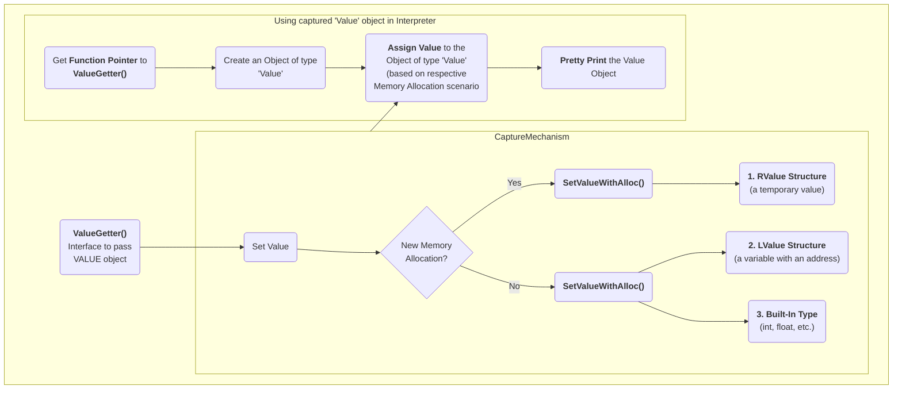

### Passing Execution Results to a 'Value' object

In many cases, it is useful to bring back the program execution result to the 
compiled program. This result can be stored in an object of type 'Value'. 

The left side in the following illustration shows how an execution result is 
passed using `ValueGetter()`, then saved in an object of type `value` using 
`SetValueWithAlloc()` or `SetValueNoAlloc()`, depending on the identified 
scenario. The right side of the illustration shows how this value object can be
 used within the interpreter.

#### How to Capture Execution Results



##### JPG Sample Image


#### Supported scenarios
Following are simplified examples of how the `ValueGetter()` function handles 
different scenarios for assigning an opaque (of unknown type) value to a 
variable (also see the decision box in preceding illustration).

```
clang-repl> void ValueGetter(void* OpaqueValue) {

SetValueNoAlloc(OpaqueValue, xQualType, x);           // 1. if x is a built-in type like int, float, etc.

SetValueNoAlloc(OpaqueValue, xQualType, &x);          // 2. if x is a struct, and a lvalue

new (SetValueWithAlloc(OpaqueValue, xQualType) (x);   // 3. if x is a struct, but a rvalue

}
```
The idea behind synthesizing different function calls for different types of 
'x' is to be able to preserve the semantics of each type (built-in, object, 
array, etc.) and store the values accordingly.

##### Improving Efficiency and User Experience

The Value object is essentially used to create a mapping between an expression 
'type' and the 'memory' to be allocated. Built-in types (bool, char, int, 
float, double, etc.) are simpler, since their memory allocation size is known. 
In case of objects, the pointer can be saved, since the size of the object is 
not known.

For further improvement, the underlying Clang Type is also identified. For 
example, `X(char, Char_S)`, where `Char_S` is the Clang type. Clang types are 
very efficient, which is important since these will be used in hotspots (high 
utilization areas of a program). The `Value.h` header file has a very low token
 count and was developed with strict constraints in mind, since it can affect 
the performance of the interpreter.

This also enables the user to receive the computed 'type' back in their code 
and then transform the type into something else (e.g., transform a double into 
a float). Normally, the compiler can handle these conversions transparently, 
but in interpreter mode, the compiler cannot see all the 'from' and 'to' types,
 so it cannot implicitly do the conversions. So this logic enables providing 
these conversions on request. 

On-request conversions can also help improve the user experince, by allowing 
conversion to a desired 'to' type, when the 'from' type is unknown or unclear

#### Return Value Object
While interacting with the interpreter, the following code gets a function 
pointer to `ValueGetter()` from JIT, to help return the object 'V' of type 
'Value'.

```
auto* F = (void(*)(void*))Interp.getSymbolAddr("ValueGetter");
Value V;
(*F)((void*)&V);
V.dump();        // Perform Pretty Printing or return the value to the user
```

#### Significance of this Feature

The 'Value' object enables wrapping a memory region that comes from the 
JIT, and bringing it back to the compiled code (and vice versa). 
This is a very useful functionality when:

- connecting an interpreter to the compiled code, or
- connecting an interpreter in another language.

For example, the `CPPYY` code makes use of this feature to enable running 
C++ within Python. It enables transporting values/information between C++ 
and Python.

In a nutshell, this feature enables a new way of developing code, paving the 
way for language interoperability and easier interactive programming.
