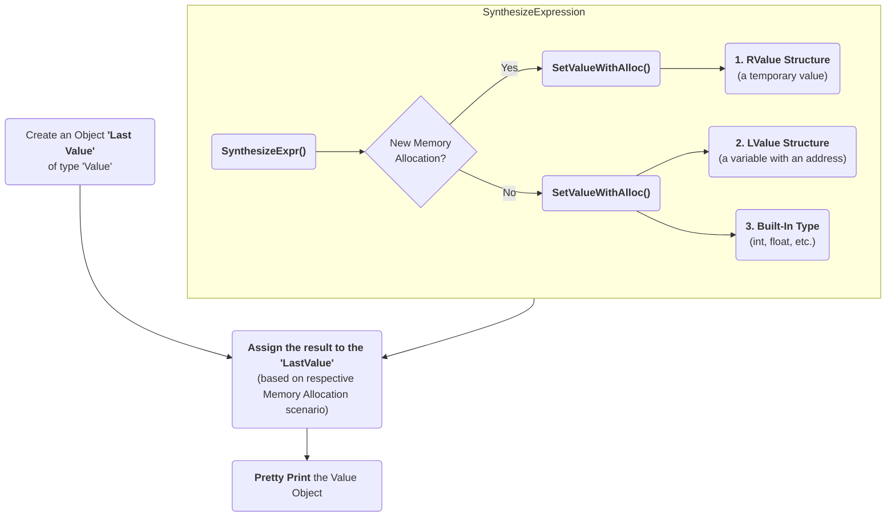

## Value Synthesis

### Passing Execution Results to a 'Value' object

In many cases, it is useful to bring back the program execution result to the 
compiled program. This result can be stored in an object of type 'Value'. 

### Incremental AST Consumer

The `IncrementalASTConsumer` class wraps the original code generator 
`ASTConsumer` and it performs a hook, to traverse all the top-level decls, to 
look for expressions to synthesize, based on the `isSemiMissing()` condition.

If this condition is found to be true, then `Interp.SynthesizeExpr()` will be 
invoked. 

```
    for (Decl *D : DGR)
      if (auto *TSD = llvm::dyn_cast<TopLevelStmtDecl>(D);
          TSD && TSD->isSemiMissing())
        TSD->setStmt(Interp.SynthesizeExpr(cast<Expr>(TSD->getStmt())));

    return Consumer->HandleTopLevelDecl(DGR);
```

The synthesizer will then choose the relevant expression, based on its type.

#### How Execution Results are captured

The synthesizer chooses which expression to synthesize, and then it replaces 
the original expression with the synthesized expression. Depending on the 
expression type, it may choose to save an object (`LastValue`) of type 'value'
 while allocating memory to it (`SetValueWithAlloc()`), or not (
`SetValueNoAlloc()`).



### Where is the captured result stored?

`LastValue` holds the last result of the value printing. It is a class member 
because it can be accessed even after subsequent inputs. 

> If no value printing happens, then it is in an invalid state. 

### Interpreter as a REPL vs. as a Library

1 - If we're using the interpreter in interactive (REPL) mode, it will dump 
the value (i.e., value printing).

```
  if (LastValue.isValid()) {
    if (!V) {
      LastValue.dump();
      LastValue.clear();
    } else
      *V = std::move(LastValue);
  }
```

2 - If we're using the interpreter as a library, then it will pass the value 
to the user.

##### Improving Efficiency and User Experience

The Value object is essentially used to create a mapping between an expression 
'type' and the 'memory' to be allocated. Built-in types (bool, char, int, 
float, double, etc.) are simpler, since their memory allocation size is known. 
In case of objects, a pointer can be saved, since the size of the object is 
not known.

For further improvement, the underlying Clang Type is also identified. For 
example, `X(char, Char_S)`, where `Char_S` is the Clang type. Clang types are 
very efficient, which is important since these will be used in hotspots (high 
utilization areas of the program). The `Value.h` header file has a very low 
token count and was developed with strict constraints in mind, since it can 
affect the performance of the interpreter.

This also enables the user to receive the computed 'type' back in their code 
and then transform the type into something else (e.g., transform a double into 
a float). Normally, the compiler can handle these conversions transparently, 
but in interpreter mode, the compiler cannot see all the 'from' and 'to' types,
 so it cannot implicitly do the conversions. So this logic enables providing 
these conversions on request. 

On-request conversions can help improve the user experience, by allowing 
conversion to a desired 'to' type, when the 'from' type is unknown or unclear

#### Significance of this Feature

The 'Value' object enables wrapping a memory region that comes from the 
JIT, and bringing it back to the compiled code (and vice versa). 
This is a very useful functionality when:

- connecting an interpreter to the compiled code, or
- connecting an interpreter in another language.

For example, the `CPPYY` code makes use of this feature to enable running 
C++ within Python. It enables transporting values/information between C++ 
and Python.

In a nutshell, this feature enables a new way of developing code, paving the 
way for language interoperability and easier interactive programming.

#### Communication between Compiled Code and Interpreted Code

In Clang-REPL there is **interpreted code**, and this feature adds a 'value' 
runtime that can talk to the **compiled code**.

Following is an example where the compiled code interacts with the interpreter 
code. The execution results of an expression are stored in the object 'V' of 
type Value. This value is then printed, effectively helping the interpreter 
use a value from the compiled code.

```
int Global = 42;
void setGlobal(int val) { Global = val; }
int getGlobal() { return Global; }
Interp.ParseAndExecute(“void setGlobal(int val);”);
Interp.ParseAndExecute(“int getGlobal();”);
Value V;
Interp.ParseAndExecute(“getGlobal()”, &V);
std::cout << V.getAs<int>() << “\n”; // Prints 42
```

> Above is an example of interoperability between the compiled code and the 
interpreted code. Interoperability between languages (e.g., C++ and Python) 
works similarly.
