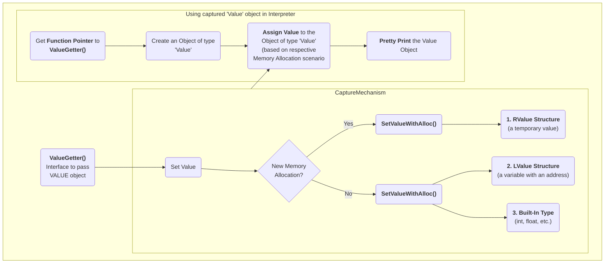
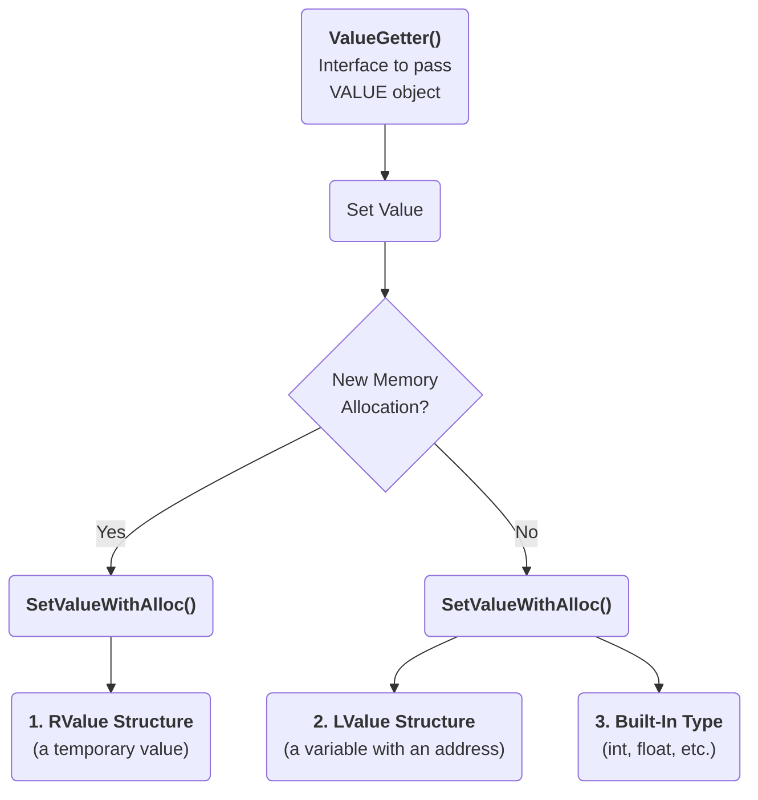
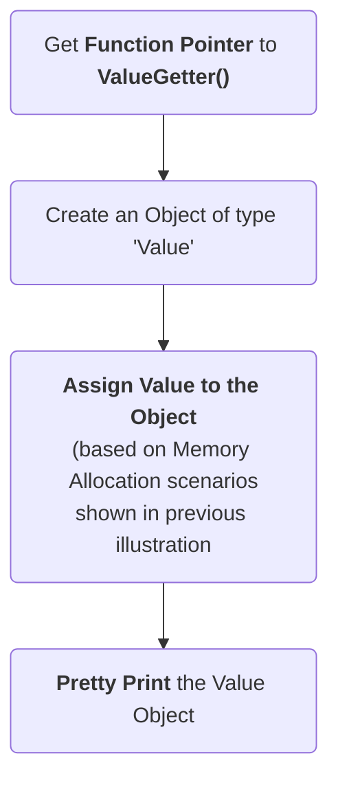

### Passing Execution Results to a 'Value' object

In many cases, it is useful to bring back the program execution result to the 
compiled program. This result can be stored in an object of type 'Value'. 

The left side in the following illustration shows how an execution result is 
passed using `ValueGetter()`, then saved in an object of type `value` using 
`SetValueWithAlloc()` or `SetValueNoAlloc()`, depending on the scenario. The 
right side of the illustration shows how this value object can be used within 
the interpreter.

#### How to Capture Execution Results



#### Separate Graphs
##### Capture Execution Results in 'Value' Object



##### Using captured 'Value' object in Interpreter




Following is a simplified example of how the `ValueGetter()` function handles 
different scenarios for assigning an opaque (of unknown type) value to a 
variable (also see the decision box in preceding illustration).

```
clang-repl> void ValueGetter(void* OpaqueValue) {

SetValueNoAlloc(OpaqueValue, xQualType, x);           // 1. if x is a built-in type like int, float

SetValueNoAlloc(OpaqueValue, xQualType, &x);          // 2. if x is a struct, and a lvalue

new (SetValueWithAlloc(OpaqueValue, xQualType) (x);   // 3. if x is a struct, but a rvalue

}
```

Next, while interacting with the interpreter, get a function pointer to 
`ValueGetter()` from JIT.

```
auto* F = (void(*)(void*))Interp.getSymbolAddr("ValueGetter");
Value V;
(*F)((void*)&V);
V.dump();        // Perform Pretty Printing or return the value to the user
```

#### Significance of this Feature

The 'Value' object enables wrapping a memory region that comes from the 
JIT, and bringing it back to the compiled code (and vice versa). 
This is a very useful functionality when:

- connecting an interpreter to the compiled code, or
- connecting an interpreter in another language.

For example, the `CPPYY` code makes use of this feature to enable running 
C++ within Python. It enables transporting values/information between C++ 
and Python.
In a nutshell, this feature enables a new way of developing code, paving the 
way for language interoperability and easier interactive programming.
