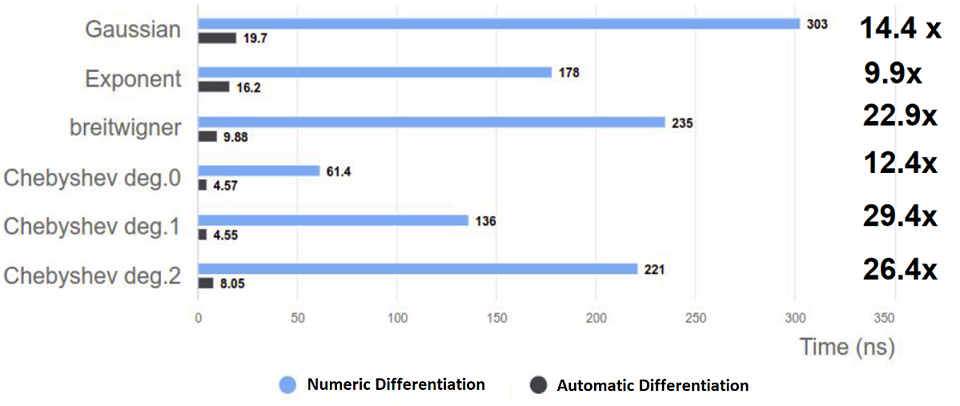

##  How to extend the use of Automatic Differentiation in RooFit

### What is RooFit?

RooFit is a statistical data analysis tool, widely used in scientific 
research, especially in the high-energy physics (HEP) field. It is an 
extension of the ROOT framework, a C++ based data analysis framework that 
provides tools for data storage, analysis, and visualization. RooFit  
provides a set of tools/classes to define probability density functions 
(PDFs), perform maximum likelihood fits, perform statistical tests, etc.


### Proof of Concept: Speeding up RooFit using Automatic Differentiation

One of the applications of RooFit is reducing statistical models (functions) 
to find a set of parameters that minimize the value of the function. This is 
accomplished using derivatives. In Numeric Differentiation (ND), derivatives 
become a bottleneck, while Automatic Differentiation (AD) is more efficient.

Following is an example performance comparison of gradient generation in 
TFormula/TF1 class in RooFit.



RooFit is an extensive toolkit that depends on ND, which has its limitations. 
The idea is to apply AD to a few components of RooFit as a proof of concept 
and then provide a template for other data scientists to expand AD 
application in different parts of RooFit.

This can be accomplished by extending all RooFit classes with a Translate 
function, which will extract all the mathematical differentiable properties 
out of these classes that a statistical model is comprised of.

### Advantages of using AD with RooFit

AD provides a better way to compute of derivatives of mathematical functions.
 Following are some of its main advantages:

- Efficient and more precise derivatives: It computes derivatives with high 
precision, avoiding the errors that may arise from approximating derivatives 
using finite differences. 

- Flexible model definition: AD can automatically compute derivatives while 
using a large number of parameters in a complex model. This prevents 
error-prone manual efforts.

- Seamless integration: AD can be seamlessly integrated in RooFit to empower 
its large userbase without any additional learning/ implementation. It would 
allow users to create and fit models based on their specific needs and 
experimental data.

- Maintainability: AD ensures consistent gradient computations, minimizing 
errors and making the code easier to maintain and debug.


### AD using Source Code Transformation in Clad

AD can be accomplished using Clad (a C++ plugin for Clang), that helps 
implement a technique called Source Code Transformation (SCT). 

> [Clad](https://compiler-research.org/clad/) is a source transformation AD 
tool implemented as a plugin to the clang compiler, which automatically 
generates the derivative code for input C++ functions. 

SCT takes the source code (that needs to be differentiated) as the input and 
generates an output code that represents the derivative of the input. This 
output code can be used instead of the input code for more efficient 
compilation.

In case of RooFit, this is done by extending RooFit classes using a 
`translate()` function, which can extract all the mathematical differentiable 
properties out of all the RooFit classes that make up the statistical model.

For more technical details, please see the following paper:

> [Automatic Differentiation of Binned Likelihoods With RooFit and Clad](https://arxiv.org/abs/2304.02650)


## Steps to add AD support in RooFit classes

1 - Locate the relevant directory

2 - Review relevant classes where AD implementation logic resides:

   - `CodeSquashContext`: helps create a C++ function out of the compute graph
  
   - `RooFuncWrapper`: helps wrap the generated C++ code in a RooFit object
    
3 - Add AD support to a RooFit Class: 
  
   - select a Class
   - create `translate()` using Helper Functions to translate existing logic
 into AD-supported logic. 
   - update `evaluate()` to expose it to Clad

> See appendix for a list of available Helper Functions.

### 1. Locate Relevant Directory

Let us look at one of the RooFit directories. Each class name starts with a 
"Roo" prefix (e.g., RooAddPdf). 

> [roofit/roofitcore/src](https://github.com/root-project/root/tree/cb08bb7445a0b8db0a64a505399844c85ed048a4/roofit/roofitcore/src)

Here we will find physical mathematical notations implemented as independent 
classes, which can be used to build a compute graph.

> A compute graph defines a complex model as an interconnected set of simpler
 building blocks(variables, functions, etc.). These components are combined 
to form a graph, where the nodes are the variables, etc. and the edges 
represent the dependencies between them. This compute graph makes up a model 
on which further data analysis can be executed.

### 2. Review AD Logic Implementation

Following classes provide several Helper Functions to translate existing logic 
into AD-supported logic.

a - CodeSquashContext

b - RooFuncWrapper

#### a. CodeSquashContext

> [roofit/roofitcore/inc/RooFit/Detail/CodeSquashContext.h](https://github.com/root-project/root/blob/6136be0d4514591d8ab93815be941702f5509298/roofit/roofitcore/inc/RooFit/Detail/CodeSquashContext.h)

It handles how to create a C++ function out of the compute graph (which is 
created with different RooFit classes). This function will be independent of 
these RooFit classes.

It helps traverse the compute graph received from RooFit and then it 
translates that into a single piece of code (a C++ function), that can then be 
differentiated using Clad. It also helps evaluate the model.

In RooFit, evalaution is done using the 'evaluate()' function. It also 
performs a lot of book-keeping, caching, etc. that is required for RooFit (but 
not necessarily for AD). 

##### `translate()` function

A new `translate()` function is added to RooFit classes that includes a call 
to the `evaluate()` function (that most RooFit classes already include). It 
helps implement the Code Squashing logic that is used to optimize numerical 
evaluations. Using helper functions, it helps convert a RooFit expression into 
a form that can be efficiently evaluated.

It returns an `std::string` representing the underlying mathematical notation
 of the class as code, that can later be concatenated into a single string 
representing the entire model. This string of code is then just-in-time 
compiled by Cling (a C++ interpreter for Root).

##### Helper Functions

- **CodeSquashContext**: this class maintains the context for squashing of 
RooFit models into code.  It keeps track of the results of various 
expressions to avoid redundant calculations.

- **Loop Scopes**: `beginloop()` and `endloop()` are used to create a scope 
for iterating over vector observables (collections of data). This is 
especially useful when dealing with data that comes in sets or arrays.

- **addToGlobalScope()**: helps add code statements to the global scope 
(e.g., to declare variables).

- **addToCodeBody()**: adds the input string to the squashed code body. If a 
class implements a translate function that wants to emit something to the 
squashed code body, it must call this function with the code it wants to 
emit. In case of loops, automatically determines if code needs to be stored 
inside or outside loop scope.

- **makeValidVarName()**: takes a string (e.g., a variable name) and converts
 it into a valid C++ variable name by replacing any forbidden characters with
 underscores. 

- **buildArg()**: helps convert RooFit objects into arrays or other C++ 
representations for efficient computation.

- **addResult()**: adds (or overwrites) the string representing the result of
 a node.

- **getResult()**: gets the result for the given node using the node name. 
This node also performs the necessary code generation through recursive calls
 to `translate()`.

- **assembleCode()**: combines the generated code statements into the final 
code body of the squashed function.

These functions will appear again in this document with more contextual 
examples. For detailed in-line documentation (code comments), please see:

> [roofit/roofitcore/src/RooFit/Detail/CodeSquashContext.cxx](https://github.com/root-project/root/blob/a50450c2701bbef8756c20ff8deaf6a48f42205b/roofit/roofitcore/src/RooFit/Detail/CodeSquashContext.cxx)


#### b. RooFuncWrapper

> [roofit/roofitcore/inc/RooFuncWrapper.h](https://github.com/root-project/root/blob/6136be0d4514591d8ab93815be941702f5509298/roofit/roofitcore/inc/RooFuncWrapper.h)

This class wraps the generated C++ code in a RooFit object, so that it can be
 used like other RooFit objects.

It takes a function body as input and creates a callable function from it. 
This allows users to evaluate the function and its derivatives efficiently.

##### Helper Functions

- **loadParamsAndData()** extracts parameters and observables from the 
provided data and prepares them for evaluation.

- **declareAndDiffFunction()**: declare the function and create its 
derivative.

- **gradient()**: calculates the gradient of the function with respect to its
 parameters.

- **buildCode()**: generates the optimized code for evaluating the function 
and its derivatives. 

- **dumpCode()**: prints the squashed code body to console(useful for 
debugging).

- **dumpGradient()**: prints the derivative code body to console (useful for 
debugging).

These functions will appear again in this document with more contextual 
examples. For detailed in-line documentation (code comments), please see:

> [roofit/roofitcore/src/RooFuncWrapper.cxx](https://github.com/root-project/root/blob/8d03a461ff8cf1b2ac3b20277cd962328b340e09/roofit/roofitcore/src/RooFuncWrapper.cxx)


### 3. Adding AD support to a RooFit Class

Let us take the `RooPoisson.cxx` class as an example. 

> [roofit/roofit/src/RooPoisson.cxx](https://github.com/root-project/root/blob/6136be0d4514591d8ab93815be941702f5509298/roofit/roofit/src/RooPoisson.cxx)

First step is to locate the `evaluate()` function. Most RooFit classes 
implement this function.

> RooFit internally calls the `evaluate()` function to evaluate a single node
 in a compute graph.

#### Before AD Support

Following is a code snippet from `RooPoisson` *before* it had AD support.

```C++
double RooPoisson::evaluate() const
{
  ...
  }										
  return TMath::Poisson(k, mean);
}
```
`TMath::Poisson()` is a simple mathematical function. To translate the 
`RooPoisson` class, create a translate function and in it include a call to 
this `TMath::Poisson()` function.

#### After AD Support

Following is a code snippet from `RooPoisson` *after* it has AD support.

##### Added `translate()` Function (using Helper Functions)

```C++
void RooPoisson::translate(RooFit::Detail::CodeSquashContext &ctx) const
{
   std::string xName = ctx.getResult(x);
     ...
   ctx.addResult(this, ctx.buildCall("RooFit::Detail::EvaluateFuncs::poissonEvaluate", xName, mean));
}
```
Following Helper Functions were used:

- `getResult()` helps lookup the result of a child node (the string that the 
child node previously saved in a variable using the `addResult()` function).  

- `addResult()` It may include a function call, an expression, or something 
more complicated. For a specific class, it will add whatever is represented on
 the right hand side to the result of this class, which can then be propagated
 in the rest of the compute graph. For each of the `translate()` functions, it
 is important to call `addResult()` since this is what enables the squashing to
 happen. 

##### Updated `evaluate()` Function

```C++
double RooPoisson::evaluate() const
{
  ...
  }
  return RooFit::Detail::EvaluateFuncs::poissonEvaluate(k, mean);
}
```

To expose the respective function to Clad (AD plugin for Clang Compiler), it 
was moved out into another in-line function into a header file named 
`EvaluateFuncs`, so that Clad could see and differentiate that function.

##### More `translate()` Examples

**Example 1:** Following is a code snippet from `RooGaussian.cxx` *after* it 
has AD support.

```C++
void RooGaussian::translate(RooFit::Detail::CodeSquashContext &ctx) const
{
   ctx.addResult(this, ctx.buildCall("RooFit::Detail::EvaluateFuncs::gaussianEvaluate", x, mean, sigma));
}
```
To expose the respective function to Clad (AD plugin for Clang Compiler), it 
was moved out into another in-line function into a header file named 
`EvaluateFuncs`, so that Clad could see and differentiate that function.

Following helper function can be seen here.

- `buildCall()` helps build a function call. Requires the fully qualified name
 (`RooFit::Detail::EvaluateFuncs::gaussianEvaluate`) of the function. When 
this external `buildCall()` function is called, internally, the `getResult()` 
function is called on the input RooFit objects (e.g., x, mean, sigma). That's 
the only way to propagate these upwards into the compute graph.

**Example 2:** A more complicated example of a `translate()` function can be 
seen here: 

```C++
void RooNLLVarNew::translate(RooFit::Detail::CodeSquashContext &ctx) const
{
   std::string weightSumName = ctx.makeValidVarName(GetName()) + "WeightSum";
   std::string resName = ctx.makeValidVarName(GetName()) + "Result";
   ctx.addResult(this, resName);
   ctx.addToGlobalScope("double " + weightSumName + " = 0.0;\n");
   ctx.addToGlobalScope("double " + resName + " = 0.0;\n");

   const bool needWeightSum = _expectedEvents || _simCount > 1;

   if (needWeightSum) {
      auto scope = ctx.beginLoop(this);
      ctx.addToCodeBody(weightSumName + " += " + ctx.getResult(*_weightVar) + ";\n");
   }
   
 ... 

}
```

> Source: - [RooNLLVarNew](https://github.com/root-project/root/blob/6136be0d4514591d8ab93815be941702f5509298/roofit/roofitcore/src/RooNLLVarNew.cxx#L298)


Helper functions from the above example:

- `makeValidVarName()` helps get a valid name from the name of the respective 
RooFit class. It then helps save it to the variable that represents the result
 of this class (the squashed code/ C++ function that will be created). 

- `addToGlobalScope()` helps declare and initialize the results variable, so 
that it can be available globally (throughout the function body). For local 
variables, the `addToCodeBody()` function can be used to keep the variables in
 the respective scope (for example, within a loop).

- `beginLoop()` helps build the start and the end of a For loop for your 
class. Simply place this function in the scope and place the contents of the 
For loop below this statement. The code squashing task will automatically 
build a loop around the statements that follow it. There's no need to worry 
about the index of these loops, because they get propagated. For example, if 
you want to iterate over a vector of RooFit objects using a loop, you don't 
have to think about indexing them properly because the `beginLoop()` function 
takes care of that. Simply call this function, place your function call in a 
scope and after the scope ends, the loop will also end.

- `addToCodeBody()` helps add things to the body of the C++ function that 
you're creating. It takes whatever string is computed in its arguments and 
adds it to the overall function string (which will later be just-in-time 
compiled). The `addToCodeBody()` function is important since not everything 
can be added in-line and this function helps split the code into multiple 
lines.

---

### Appendix - Helper functions discussed in this document

- **addResult()**: It may include a function call, an expression, or something
 more complicated. For a specific class, it will add whatever is represented 
on the right hand side to the result of this class, which can then be 
propagated in the rest of the compute graph. For each of the `translate()` 
functions, it is important to call `addResult()` since this is what enables 
the squashing to happen.

- **addToCodeBody()**: It helps add things to the body of the C++ function 
that you're creating. It takes whatever string is computed in its arguments 
and adds it to the overall function string (which will later be just-in-time 
compiled). The `addToCodeBody()` function is important since not everything 
can be added in-line and this function helps split the code into multiple 
lines.

- **addToGlobalScope()**: It helps declare and initialize the results 
variable, so that it can be available globally (throughout the function body).
 For local variables, the `addToCodeBody()` function can be used to keep the 
variables in the respective scope (for example, within a loop).

- **assembleCode()**: combines the generated code statements into the final 
code body of the squashed function.

- **beginLoop()**: It helps build the start and the end of a For loop for your
 class. Simply place this function in the scope and place the contents of the 
For loop below this statement. The code squashing task will automatically 
build a loop around the statements that follow it. There's no need to worry 
about the index of these loops, because they get propagated. For example, if 
you want to iterate over a vector of RooFit objects using a loop, you don't 
have to think about indexing them properly because the `beginLoop()` function 
takes care of that. Simply call this function, place your function call in a 
scope and after the scope ends, the loop will also end.

- **buildArg()**: helps convert RooFit objects into arrays or other C++ 
representations for efficient computation.

- **buildCall()**: Helps build a function call. Requires the fully qualified 
name of the function. When this external `buildCall()` function is called, 
internally, the `getResult()` function is called on the input RooFit objects 
(e.g., x, mean, sigma). That's the only way to propagate these upwards into 
the compute graph.

- **buildCode()**: generates the optimized code for evaluating the function 
and its derivatives. 

- **declareAndDiffFunction()**: declare the function and create its 
derivative.

- **dumpCode()**: prints the squashed code body to console(useful for 
debugging).

- **dumpGradient()**: prints the derivative code body to console (useful for 
debugging).

- **evaluate()**: All RooFit classes implement this function. It performs a 
lot of book-keeping, caching, etc. that is required for RooFit (but not 
necessarily for AD). 

- **getResult()**: It helps lookup the result of a child node (the string that
 the child node previously saved in a variable using the `addResult()` 
function). 

- **gradient()**: calculates the gradient of the function with respect to its
 parameters.

- **loadParamsAndData()** extracts parameters and observables from the 
provided data and prepares them for evaluation. 

- **makeValidVarName()**: It helps get a valid name from the name of the 
respective RooFit class. It then helps save it to the variable that represents
 the result of this class (the squashed code/ C++ function that will be 
created). 

- **translate()**: All RooFit classes that should support AD need to use this 
function. It creates a string of code, which is then just-in-time compiled 
using Cling (C++ interpreter for ROOT). For each of the `translate()` 
functions, it is important to call `addResult()` since this is what enables 
the squashing to happen.
