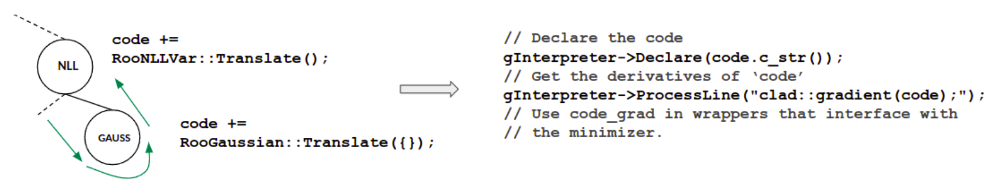

##  How to extend the use of Automatic Differentitation in RooFit

### What is Roofit?

Roofit is a statistical data analysis tool, widely used in scientific 
research, especially in the high-energy physics (HEP) field. It is an 
extension of the ROOT framework, a C++ based data analysis framework that 
provides tools for data storage, analysis, and visualization. Roofit  
provides a set of tools/classes to define probability density functions 
(PDFs), perform maximum likelihood fits, perform statistical tests, etc.


### Proof of Concept: Speeding up RooFit using Automatic Differentitation

One of the applications of Roofit is reducing statistical models (functions) 
to find a set of parameters that minimize the value of the function. This is 
accomplished using derivatives. In ND, derivatives become a bottleneck, while
 AD is more efficient.

Following is an example performance comparison of gradient generation in 
TFormula/TF1 class in Roofit.


Roofit is an extensive toolkit that depends on Numeric Differentitation (ND),
 which has its limitations. The idea is to apply Automatic Differentitation 
(AD) to a few components of Roofit as a proof of concept and then provide a 
template for other data scientists to expand AD application in different 
parts of Roofit.

This can be accomplished by extending all Roofit classes with a Translate 
function, which will extract all the mathematical differentiable properties 
out of these classes that a statistical model is comprised of.


### Advantages of using AD with RooFit

AD provides a better way to compute of derivatives of mathematical functions.
 Following are some of its main advantages:

- Efficient and more precise derivatives: It computes derivatives with high 
precision, avoiding the errors that may arise from approximating derivatives 
using finite differences. 

- Flexible model definition: AD can automatically compute derivatives while 
using a large number of parameters in a complex model. This prevents 
error-prone manual efforts.

- Seamless integration: AD can be seamlessly integrated in Roofit to empower 
its large userbase without any additional learning/ implementation. It would 
allow users to create and fit models based on their specific needs and 
experimental data.

- Maintainability: AD ensures consistent gradient computations, minimizing 
errors and making the code easier to maintain and debug.


### How to add AD support in Roofit entities?

Let us look at one of the roofit directories. Each class name starts with a 
"Roo" prefix (e.g., RooAddPdf). 

> [roofit/roofitcore/src](https://github.com/root-project/root/tree/cb08bb7445a0b8db0a64a505399844c85ed048a4/roofit/roofitcore/src)

Here we will find physical methamatical notations implemented as independant 
classes, which can be used to build a compute graph.

> A compute graph defines a complex model as an interconnected set of simpler
 building blocks(variables, functions, etc.). These components are combined 
to form a graph, where the nodes are the variables, etc. and the edges 
represent the dependencies between them. This compute graph makes up a model 
on which further data analysis can be executed.

### AD Logic Implementation

To view the AD logic, let us look at the following classes.

#### 1. CodeSquashContext

> [roofit/roofitcore/inc/RooFit/Detail/CodeSquashContext.h](https://github.com/root-project/root/blob/6136be0d4514591d8ab93815be941702f5509298/roofit/roofitcore/inc/RooFit/Detail/CodeSquashContext.h)

It handles how to create a C++ function out of the compute graph (which is 
created with different Roofit classes). This function will be independent of 
these Roofit classes.

The compute graph received from Roofit is traversed to create a piece of code 
that can be differentiated. 



This requires Roofit classes to be transformed to expose their differential 
properties. A lot of book-keeping, caching, etc. that is required for Roofit 
(but not nessesarily for AD) is then done. It also evaluates things that 
don't need to be differentiated. 


The ”translate” function returns an `std::string` representing the underlying
 mathematical notation of the class as code that can later be concatenated 
into a single string representing the entire model.


For more technical details, please see the following paper:

> [Automatic Differentiation of Binned Likelihoods With Roofit and Clad](https://arxiv.org/abs/2304.02650)

For detailed in-line documentation (code comments), please see:

> [roofit/roofitcore/src/RooFit/Detail/CodeSquashContext.cxx](https://github.com/root-project/root/blob/a50450c2701bbef8756c20ff8deaf6a48f42205b/roofit/roofitcore/src/RooFit/Detail/CodeSquashContext.cxx)


#### 2. RooFuncWrapper

> [roofit/roofitcore/inc/RooFuncWrapper.h](https://github.com/root-project/root/blob/6136be0d4514591d8ab93815be941702f5509298/roofit/roofitcore/inc/RooFuncWrapper.h)

This class wraps the generated C++ code in a Roofit object, so that it can be
 used like other roofit objects.
 

## Adding AD support to a Roofit Class

Let us take the `RooPoisson.cxx` class as an example. 

> [roofit/roofit/src/RooPoisson.cxx](https://github.com/root-project/root/blob/6136be0d4514591d8ab93815be941702f5509298/roofit/roofit/src/RooPoisson.cxx)

First step is to locate the `evalaute()` function. Most Roofit classes 
implement this function.

> Roofit internally calls the `evaluate()` function to evaluate a single node
 in a compute graph.

### Before AD Support

Following is a code snippet from `RooPoisson` *before* it had AD support.

```C++
double RooPoisson::evaluate() const
{
  ...
  }										
  return TMath::Poisson(k, mean);
}
```
`TMath::Poisson()` is a simple mathematical function. To translate the 
`RooPoisson` class, create a translate function and in it include a call to 
this `TMath::Poisson()` function.

### After AD support

Following is a code snippet from `RooGaussian.cxx` *after* it had AD support.

```C++
void RooGaussian::translate(RooFit::Detail::CodeSquashContext &ctx) const
{
   // Build a call to the stateless gaussian defined later.
   ctx.addResult(this, ctx.buildCall("RooFit::Detail::EvaluateFuncs::gaussianEvaluate", x, mean, sigma));
}
```
To expose the respective function to Clad (AD plugin for Clang Compiler), it 
was moved out into another in-line function into a header file names 
`EvaluateFuncs`, so that Clad could see and differentiate that function.

Some helper functions can also be seen here.

- `buildCall()` helps build a function call. Requires the fully qualified name
 (`RooFit::Detail::EvaluateFuncs::gaussianEvaluate`) of the function. When 
this external `buildCall()` function is called, internally, the `getResult()` 
function is called on the input Roofit objects (e.g., x, mean, sigma). That's 
the only way to propagate these upwards into the compute graph.

- `addResult()` It may include a function call, an expression, or something 
more complicated. For a specific class, it will add whatever is represented on
 the right hand side to the result of this class, which can then be propagated
 in the rest of the compute graph. For each of the `translate()` functions, it
 is important to call `addResult()` since this is what enable the squashing to
 happen. 

A more compicated example of a `translate()` function can be seen [here](https://github.com/root-project/root/blob/6136be0d4514591d8ab93815be941702f5509298/roofit/roofitcore/src/RooNLLVarNew.cxx#L298).

```C++
void RooNLLVarNew::translate(RooFit::Detail::CodeSquashContext &ctx) const
{
   std::string weightSumName = ctx.makeValidVarName(GetName()) + "WeightSum";
   std::string resName = ctx.makeValidVarName(GetName()) + "Result";
   ctx.addResult(this, resName);
   ctx.addToGlobalScope("double " + weightSumName + " = 0.0;\n");
   ctx.addToGlobalScope("double " + resName + " = 0.0;\n");

   const bool needWeightSum = _expectedEvents || _simCount > 1;

   if (needWeightSum) {
      auto scope = ctx.beginLoop(this);
      ctx.addToCodeBody(weightSumName + " += " + ctx.getResult(*_weightVar) + ";\n");
   }
   
 ... 

}
```

Some more helper functions can also be seen here.

- `makeValidVarName()` helps get a valid name from the name of the respective 
Roofit class. It then helps save it to the variable that represents the result
 of this class (the squashed code/ C++ function that will be created). 

- `addToGlobalScope()` helps declare and initialize the results variable, so 
that it can be available globally (throughout the function body). For local 
variables, the `addToCodeBody()` function can be used to keep the variables in
 the respective scope (for example, within a loop).

- `beginLoop()` helps build the start and the end of a For loop for your 
class. Simply place this function in the scope and place the contents of the 
For loop below this statement. The code squashing task will automatically 
build a loop around the statements that follow it. There's no need to worry 
about the index of these loops, because they get propagated. For example, if 
you want to iterate over a vector of Roofit objects using a loop, you don't 
have to think about indexing them properly because the `beginLoop()` function 
takes care of that. Simply call this function, place your function call in a 
scope and after the scope ends, the loop will also end.

- `addToCodeBody()` helps add things to the body of the C++ function that 
you're creating. It takes whatever string is computed in its arguments and 
adds it to the overall function string (which will later be just-in-time 
compiled). The `addToCodeBody()` function is important since not everything 
can be added in-line and this function helps split the code into multiple 
lines.

- `getResult()` helps lookup the result of a child node (the string that the 
child node previously saved in a variable using the `addResult()` function).  

---

### Appendix - Helper functions

- **evaluate()**: All Roofit classes implement this function. It performs a 
lot of book-keeping, caching, etc. that is required for Roofit (but not 
nessesarily for AD). 

- **translate()**: All Roofit classes that should support AD need to use this 
function. It creates a string of code, which is then just-in-time compiled 
using Cling (C++ interpreter for ROOT). For each of the `translate()` 
functions, it is important to call `addResult()` since this is what enables 
the squashing to happen.

- **buildCall()**: Helps build a function call. Requires the fully qualified 
name of the function. When this external `buildCall()` function is called, 
internally, the `getResult()` function is called on the input Roofit objects 
(e.g., x, mean, sigma). That's the only way to propagate these upwards into 
the compute graph.

- **addResult()**: It may include a function call, an expression, or something
 more complicated. For a specific class, it will add whatever is represented 
on the right hand side to the result of this class, which can then be 
propagated in the rest of the compute graph. For each of the `translate()` 
functions, it is important to call `addResult()` since this is what enables 
the squashing to happen.

- **makeValidVarName()**: It \helps get a valid name from the name of the 
respective Roofit class. It then helps save it to the variable that represents
 the result of this class (the squashed code/ C++ function that will be 
created). 

- **addToGlobalScope()**: It helps declare and initialize the results 
variable, so that it can be available globally (throughout the function body).
 For local variables, the `addToCodeBody()` function can be used to keep the 
variables in the respective scope (for example, within a loop).

- **beginLoop()**: It helps build the start and the end of a For loop for your
 class. Simply place this function in the scope and place the contents of the 
For loop below this statement. The code squashing task will automatically 
build a loop around the statements that follow it. There's no need to worry 
about the index of these loops, because they get propagated. For example, if 
you want to iterate over a vector of Roofit objects using a loop, you don't 
have to think about indexing them properly because the `beginLoop()` function 
takes care of that. Simply call this function, place your function call in a 
scope and after the scope ends, the loop will also end.

- **addToCodeBody()**: It helps add things to the body of the C++ function 
that you're creating. It takes whatever string is computed in its arguments 
and adds it to the overall function string (which will later be just-in-time 
compiled). The `addToCodeBody()` function is important since not everything 
can be added in-line and this function helps split the code into multiple 
lines.

- **getResult()**: It helps lookup the result of a child node (the string that
 the child node previously saved in a variable using the `addResult()` 
function).  
